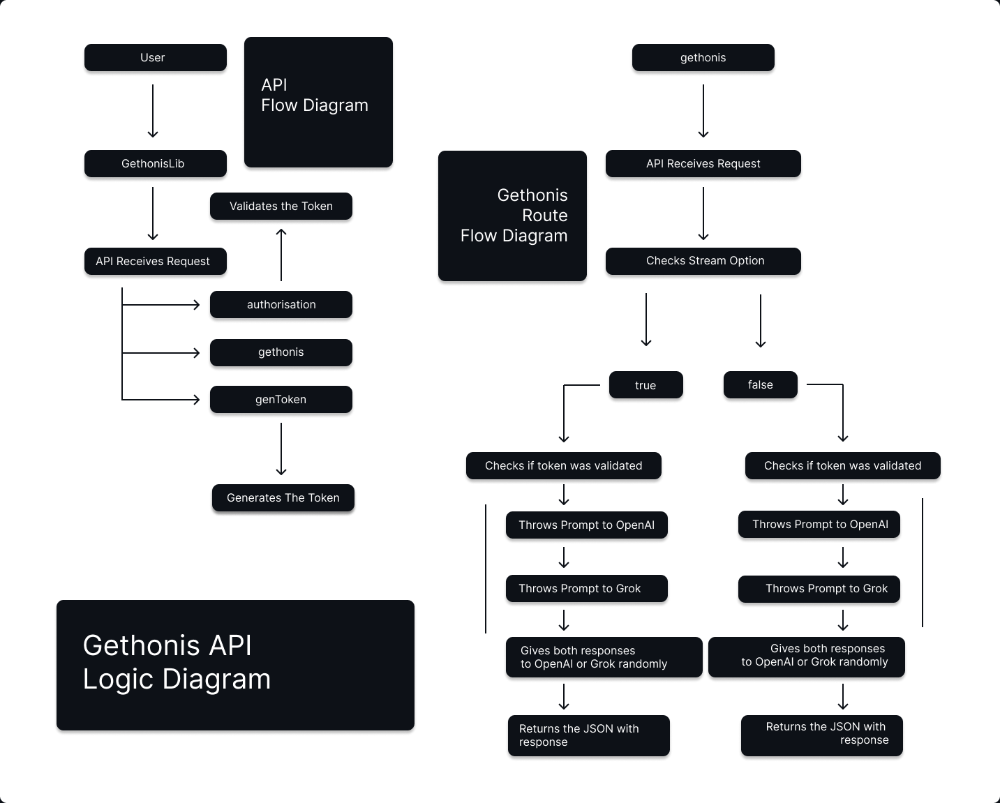

# 🚀 GethonisAIApi
### API endpoint that merges outputs from two language models, applies response optimization, and returns the most suitable result.

## 📚 Table of Contents

1. [Screenshots / Diagram](#-1-screenshots--diagram)
2. [Overview](#-2-overview--introduction)
3. [Features](#-3-features)
4. [Tech Stack](#-4-tech-stack)
5. [Project Structure](#-5-project-structure)
6. [Getting Started](#-6-getting-started)
7. [Installation](#-7-authentication)
8. [Authentication](#-8-authentication)
9. [Example Usage](#-9-example-usage)
10. [API Documentation](#-10-api-documentation)
11. [Testing & CI/CD](#-11-testing--cicd)
12. [Performance & Benchmarks](#-12-future-features)
13. [Future Features](#-13-future-features)
14. [Contributing](#%EF%B8%8F-14-contributing)
15. [Contact](#-15-contact)

## 📸 1. Screenshots / Diagram




## 🧠 2. Overview / Introduction
Gethonis is a Python FastAPI-powered API designed to combine responses from two AI models, OpenAI and Grok, and to return the best optimised answer. The API was implemented in a Python Based web service and across two discord chatbots. 
**Target Users** 
AI developers and enterprises seeking to leverage multiple AI engines through a single, scalable interface.

**What problems solves?**
* Eliminates reliance on a single AI model by fusing multi-model outputs.
* Enhances response quality via automated correction and optimisation.
* Simplifies deployment with Docker and cloud hosting on Hetzner.

**Key Strengths & goals**
* Modularity, easily switch between OpenAI and Grok models can be extended to others
* Scalability & performance, Docker containerised, hosted on Hetzner cloud, built for high throughput and low latency.
* Security & UX, Secured API endpoints with clear request/response schemas and error handling.
* Developer experience, Fully typed Python code, automated CI/CD pipelines via GitHub Actions for testing, linting, and deployment.

## ✨ 3. Features
* Combines output from two AI models and returns the most suitable response.
* Supports two AI engines with modular backend design
* Containerised with Docker for consistent deployment
* CI/CD integraiton with Github Actions for smooth dev workflow
* Hosted on a scalable Hetzner Cloud Server
* Secured, validated API requests and typed responses for reliability

## 🧰 4. Tech Stack

| Layer | Technologies Used | 
| -------- | -------- |
| Backend     | Python, FastAPI     |
| AI Models     | OpenAI, Grok     |
| Deployment    | Docker, Hetzner Cloud, Github Actions    |
| Testing     | Pytest     |
| CI/CD     | Github Actions Workflow    |


## 📂 5. Project Structure
```
gethonis/
├── app/
│   ├── api/                    # API route handlers, and authentication
│   │   ├── __init__.py
│   │   ├── authentication.py   # Authentication handler
│   │   ├── routes.py           # Route Handler
│   ├── core/                   # Core essentials and models
│   │   ├── __init__.py
│   │   ├── core.py             # AI models prompt generators
│   │   ├── utils.py            # Bridge integration methods along BaseModel types
│   ├── db/                     # Database connection handlers
│   │   ├── __init__.py         
│   │   ├── session.py          # Database session
│   ├── static/                 # Styling and Media storing 
│   │   ├── style.css           # CSS file for frontend page
│   ├── templates/              # Html files for frontend integration
│   │   ├── index.html          # Main page of token generator
│   ├── Dockerfile              
│   ├── main.py                 # FastAPI entrypoint connected to api/routes.py clean integration
│   ├── requirements.txt
├── tests/               	# Unit and integration tests
└── README.md
```
## 🚀 6. Getting Started
**Prerequisites:**
* Python 3.8+
* Docker

## 🛠 7. Installation
```bash
git clone https://github.com/lucian-xinitrc/GethonisAIApi.git 
cd GethonisAIApi
docker build --no-cache -t gethonisapi .
docker run -d -p 8000:8000 --restart unless-stopped --name gethonis-api gethonisapi
```
## 🔐 8. Authentication
1. Generate token on [gethonis.com](https://gethonis.com)
2. Add headers in json and 'token'

## 📬 9. Example Usage
```python
import gethonis as geth

bot = geth.Gethonis("geth-...", "baseurl")
message = "Test Meessage"
bot.set_message("gethonis", False)
print(bot.get_message(message))
```

## 📄 10. API Documentation
* Swagger UI: [api.gethonis.com/docs](https://api.gethonis.com/docs)
* ReDoc: [api.gethonis.com/redocs](https://api.gethonis.com/docs)

## 🧪 11. Testing & CI/CD
* Run tests: pytest tests/
* CI/CD pipeline runs linting, tests, and builds Docker images automatically on Github Actions

## 📈 12. Performance & Benchmarks
| Metric | Value | 
| -------- | -------- |
| Average Response time     | ~40 ms     |
|Throughput | 800+ req/sec |
|Memory Usage | <150 MB

## 💡 13. Future Features
* Adding Redis aching layer for response speedup
* Expand test coverage
* Monitoring integration with Prometheus and Grafana
* Enhancing more advanced 

## 🙋‍♂️ 14. Contributing
1. Fork the repo
2. Create feature branch: `git checkout -b feature/AmazingFeature`
3. Commit changes and push
4. Open a Pull Request for review

## 📫 15. Contact
Name: Lucian-Florin Cusmir

Github: github.com/lucian-xinitrc

Email: cusmirlucian@gmail.com